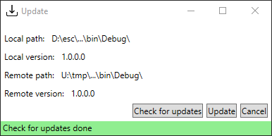
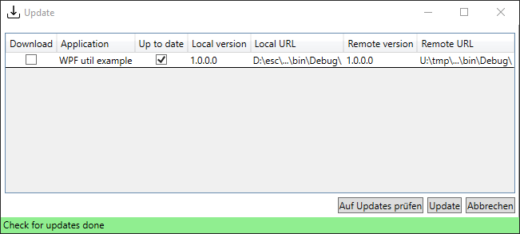
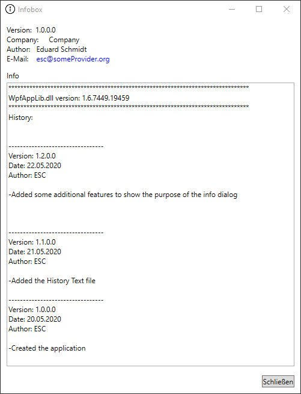

# Wpf Utils

This is an collection of useful WPF based additions to an WPF application.
I created this library in order to not mess around with the simple stuff of my applications for each application. 

Icons used are from: <a href="https://www.flaticon.com/de/autoren/freepik" title="Freepik">Freepik</a> from <a href="https://www.flaticon.com/de/" title="Flaticon"> www.flaticon.com</a>

## Example app

## Updater
A simple File based update mechanism. Most of my applications are running in an busines environment. So we always have a couple of file servers. In order to update the application just hand over the settings with the file location and settings file and the updater checks for updates corresponding to the file version.

There is an single application updater...

and an multi application updater.

## Info
A simple file version dialog with the ability to show the change log.

